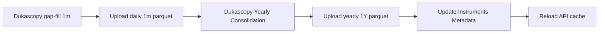
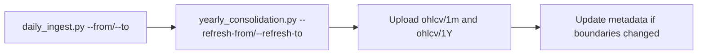

# dukaparquet

Dukascopy 1-minute OHLCV ingestion and yearly parquet consolidation for the symbols in `symbols.yaml`.

Data is stored with this layout:

```text
ohlcv/1m/symbol=ES/date=2026-05-22/ES_2026-05-22.parquet
ohlcv/1Y/symbol=ES/year=2026/ES_2026.parquet
```

Remote MinIO paths used by the scripts and GitHub Actions:

```text
myminio/dukascopy-node/ohlcv/1m/
myminio/dukascopy-node/ohlcv/1Y/
myminio/dukascopy-node/metadata/instruments.json
```

## Prerequisites

Local runs expect Python packages, Node/npm, `dukascopy-node`, and MinIO client `mc`.

```cmd
pip install pandas pyarrow pyyaml polars
```

```cmd
npm install -g dukascopy-node
```

Configure the MinIO alias before running workflows that read or write the bucket:

```cmd
mc alias set myminio %MINIO_ENDPOINT% %MINIO_KEY% %MINIO_SECRET%
```

Available symbols are `ES`, `NQ`, `DAX`, `FTSE`, `DJIA`, `RUT`, `GOLD`, `BTC`, `VIX`, and `NIKKEI`.

## Repair Backfill Example

GitHub Actions repair for specific symbols:

```cmd
gh workflow run "Dukascopy gap-fill 1m" -R cssfr/dukaparquet-1m -f from_date=2026-05-22 -f to_date=2026-05-29 -f symbols=ES,NQ
```

```cmd
gh workflow run "Dukascopy Yearly Consolidation" -R cssfr/dukaparquet-1m -f from_date=2026-05-22 -f to_date=2026-05-29 -f symbols=ES,NQ
```

GitHub Actions repair for all symbols:

```cmd
gh workflow run "Dukascopy gap-fill 1m" -R cssfr/dukaparquet-1m -f from_date=2026-05-22 -f to_date=2026-05-29
```

```cmd
gh workflow run "Dukascopy Yearly Consolidation" -R cssfr/dukaparquet-1m -f from_date=2026-05-22 -f to_date=2026-05-29
```

Run the yearly command after the daily repair workflow finishes successfully.

To repair daily files from `2026-05-22` through today, `2026-05-29`, for `ES` and `NQ`, regenerate the daily 1m parquet files first:

```cmd
python daily_ingest.py --symbols ES,NQ --from 2026-05-22 --to 2026-05-29
```

Download the existing yearly files before local consolidation. This lets the refresh replace only the repair window instead of creating partial yearly files from whatever daily files happen to exist locally.

```cmd
mc mirror --overwrite myminio/dukascopy-node/ohlcv/1Y/ ohlcv/1Y/
```

Then refresh the current-year yearly files for the same window:

```cmd
python yearly_consolidation.py --consolidate-only --refresh-from 2026-05-22 --refresh-to 2026-05-29
```

Finally upload the repaired daily and yearly parquet files:

```cmd
mc mirror --overwrite ohlcv/1m/ myminio/dukascopy-node/ohlcv/1m/
```

```cmd
mc mirror --overwrite ohlcv/1Y/ myminio/dukascopy-node/ohlcv/1Y/
```

For complete daily candles, prefer ending at yesterday UTC. Passing today's date attempts to download the current UTC day, which may still be incomplete.

If you launch the repair through the `Dukascopy gap-fill 1m` GitHub Actions workflow, `Dukascopy Yearly Consolidation` is triggered automatically after the daily workflow succeeds on `main`. However, that automatic `workflow_run` trigger does not receive the manual `from_date`, `to_date`, or `symbols` inputs from the daily workflow. For a repair window that may already exist inside the yearly parquet, manually run `Dukascopy Yearly Consolidation` with the same date window so it uses `--refresh-from` and `--refresh-to`.

## Daily Ingest Workflow

Script: `daily_ingest.py`

This creates missing daily 1m parquet files under `ohlcv/1m`.

Run normal gap-fill for all symbols from their latest local date through yesterday UTC:

```cmd
python daily_ingest.py
```

Run a specific symbol range:

```cmd
python daily_ingest.py --symbols ES --from 2026-05-22 --to 2026-05-29
```

Run multiple symbols:

```cmd
python daily_ingest.py --symbols ES,NQ,BTC --from 2026-05-22 --to 2026-05-29
```

Upload generated daily files:

```cmd
mc mirror --overwrite ohlcv/1m/ myminio/dukascopy-node/ohlcv/1m/
```

GitHub Actions workflow: `Dukascopy gap-fill 1m`

Manual trigger with GitHub CLI:

```cmd
gh workflow run "Dukascopy gap-fill 1m" -R cssfr/dukaparquet-1m -f from_date=2026-05-22 -f to_date=2026-05-29 -f symbols=ES,NQ
```

Manual targeted repair for all symbols:

```cmd
gh workflow run "Dukascopy gap-fill 1m" -R cssfr/dukaparquet-1m -f from_date=2026-05-22 -f to_date=2026-05-29
```

You can also pass an empty `symbols` input explicitly:

```cmd
gh workflow run "Dukascopy gap-fill 1m" -R cssfr/dukaparquet-1m -f from_date=2026-05-22 -f to_date=2026-05-29 -f symbols=
```

The `-R cssfr/dukaparquet-1m` flag makes the command work from any directory, not only from inside this Git checkout. If `symbols` is empty or omitted, the workflow processes all symbols. If `to_date` is empty, it ends at yesterday UTC.

## Missing-History Backfill Workflow

Script: `backfill_missing.py`

This scans MinIO for each symbol's earliest available remote date and backfills anything missing before that date, based on `earliest_date` in `symbols.yaml`. It does not accept CLI flags.

```cmd
python backfill_missing.py
```

Upload generated daily files:

```cmd
mc mirror --overwrite ohlcv/1m/ myminio/dukascopy-node/ohlcv/1m/
```

GitHub Actions workflow: `Dukascopy Backfill 1m`

```cmd
gh workflow run "Dukascopy Backfill 1m" -R cssfr/dukaparquet-1m
```

Use this for filling old missing history. Use `daily_ingest.py --from ... --to ...` for a targeted repair window such as `2026-05-22` to today.

## Current-Year Consolidation Workflow

Script: `yearly_consolidation.py`

This builds or updates `ohlcv/1Y` for the current calendar year only.

Download current-year daily files for one symbol from MinIO:

```cmd
python yearly_consolidation.py --download-only --symbol ES
```

Download a specific current-year refresh window:

```cmd
python yearly_consolidation.py --download-only --symbol ES --refresh-from 2026-05-22 --refresh-to 2026-05-29
```

Consolidate all local current-year daily files into yearly files:

```cmd
python yearly_consolidation.py --consolidate-only
```

Refresh yearly files for a specific current-year date window:

```cmd
python yearly_consolidation.py --consolidate-only --refresh-from 2026-05-22 --refresh-to 2026-05-29
```

Upload yearly files:

```cmd
mc mirror --overwrite ohlcv/1Y/ myminio/dukascopy-node/ohlcv/1Y/
```

GitHub Actions workflow: `Dukascopy Yearly Consolidation`

```cmd
gh workflow run "Dukascopy Yearly Consolidation" -R cssfr/dukaparquet-1m -f from_date=2026-05-22 -f to_date=2026-05-29 -f symbols=ES,NQ
```

This workflow also runs automatically after a successful `Dukascopy gap-fill 1m` run on `main`.

Note: the automatic trigger is good for normal incremental updates. For repair backfills inside an already-consolidated current-year range, manually dispatch this workflow with `from_date` and `to_date` so the existing yearly rows in that window are replaced.

## Historical Yearly Consolidation Workflow

Script: `historical_consolidation_script.py`

This consolidates historical years up to the previous calendar year. In 2026, it processes available years through 2025.

Run download and consolidation for all symbols and all historical years available in MinIO:

```cmd
python historical_consolidation_script.py
```

Run for one symbol:

```cmd
python historical_consolidation_script.py --symbol ES
```

Download only one symbol/year:

```cmd
python historical_consolidation_script.py --download-only --symbol ES --year 2025
```

Consolidate already-downloaded local historical files only:

```cmd
python historical_consolidation_script.py --consolidate-only --symbol ES
```

Upload yearly files:

```cmd
mc mirror --overwrite ohlcv/1Y/ myminio/dukascopy-node/ohlcv/1Y/
```

GitHub Actions workflow: `Historical Yearly Consolidation (Backfill)`

```cmd
gh workflow run "Historical Yearly Consolidation (Backfill)" -R cssfr/dukaparquet-1m -f symbol=ES
```

To process all symbols in GitHub Actions, omit the `symbol` input.

```cmd
gh workflow run "Historical Yearly Consolidation (Backfill)" -R cssfr/dukaparquet-1m
```

## Metadata Update Workflow

Script: `update_instruments_metadata.py`

This downloads or reads yearly parquet metadata boundaries and updates `instruments.json`.

Download current metadata first:

```cmd
mc cp myminio/dukascopy-node/metadata/instruments.json instruments.json
```

Update it locally:

```cmd
python update_instruments_metadata.py
```

Upload the updated metadata:

```cmd
mc cp instruments.json myminio/dukascopy-node/metadata/instruments.json
```

GitHub Actions workflow: `Update Instruments Metadata`

```cmd
gh workflow run "Update Instruments Metadata" -R cssfr/dukaparquet-1m
```

This workflow also runs automatically after a successful `Dukascopy Yearly Consolidation` run on `main`.

## Typical End-to-End Runs

Daily scheduled path:



Manual repair path:


